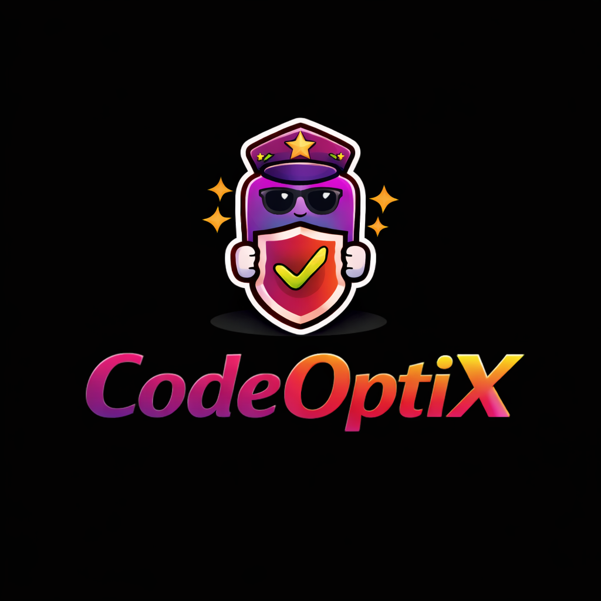

<div align="center">



# CodeOptiX

**Agentic Code Optimization for better Coding Agent Experience**

**Agentic Code Optimization Platform - GEPA optimization, Bloom evals, and behavior testing**

[](https://www.python.org/downloads/)
[](https://opensource.org/licenses/Apache-2.0)
[](https://github.com/astral-sh/ruff)

[🚀 Get Started](#-quick-start-30-seconds) • [📖 Documentation](https://codeoptix.ai/docs) • [💬 Discussions](https://github.com/SuperagenticAI/codeoptix/discussions) • [🐛 Issues](https://github.com/SuperagenticAI/codeoptix/issues)

</div>

---

## 🎯 What is CodeOptiX?

CodeOptiX is an **open-source behavioral optimization platform** focused on GEPA optimization, Bloom evals, and behavior testing for coding agents. Built by [Superagentic AI](https://super-agentic.ai), it helps you:

- ✅ **GEPA Optimization** - Automatically improve agent behavior using Genetic-Pareto Evolution
- ✅ **Bloom Evaluations** - Deep behavioral evaluation with Bloom-style scenario generation
- ✅ **Behavior Testing** - Test coding agents against configurable behavior specifications
- ✅ **Local LLM Support** - Use Ollama for local model evaluation (no API key required!)
- ✅ **Multi-Provider Support** - Works with OpenAI, Anthropic, Google, and Ollama

### Key Features

- 🤖 **Agent-Agnostic** - Works with any coding agent (Claude Code, Codex, Gemini CLI, ACP-compatible agents)
- 🎯 **Behavior Testing** - Modular behavior specifications (security, test quality, plan alignment)
- 🔄 **GEPA Optimization** - Evolves agent prompts/policies using Genetic-Pareto Evolution
- 📊 **Bloom Evaluations** - Deep behavioral evaluation with Bloom-style scenario generation
- 🧠 **Ollama Support** - Use local Ollama models without API keys
- 📈 **Reproducible** - All evaluations, reflections, and evolutions are versioned
- 🔌 **Multiple Usage Modes** - CLI, CI/CD integration, ACP quality bridge, standalone API
- ✅ **CI/CD Ready** - GitHub Actions integration for automated quality gates

---

## 🚀 Quick Start (30 Seconds)

### Installation

```bash
# Using pip
pip install codeoptix

# Using uv (recommended, faster)
uv pip install codeoptix
```

### Your First Evaluation

#### Option 1: Using Ollama (No API Key Required!)

```bash
# 1. Make sure Ollama is running
ollama serve

# 2. Run your first check with local Ollama
codeoptix eval \
  --agent claude-code \
  --behaviors insecure-code \
  --llm-provider ollama \
  --config examples/configs/ollama-insecure-code.yaml
```

#### Option 2: Using Cloud Providers

```bash
# 1. Set API key
export OPENAI_API_KEY="your-key-here"

# 2. Run your first check
codeoptix eval \
  --agent claude-code \
  --behaviors insecure-code \
  --llm-provider openai
```

**That's it!** You've just run your first evaluation.

> **Note:** CodeOptiX supports multiple LLM providers:
> - **Ollama** (local, no API key required) - Recommended for open-source users
> - **OpenAI** - Requires API key
> - **Anthropic** - Requires API key
> - **Google** - Requires API key

---

## 📖 Documentation

- **[Installation Guide](docs/getting-started/installation.md)** - Detailed setup instructions
- **[Quick Start Guide](docs/getting-started/quickstart.md)** - Get up and running quickly
- **[Single Behavior Quickstart](docs/getting-started/single-behavior-quickstart.md)** ⭐ - Perfect for first-time users
- **[GitHub Actions Integration](docs/guides/github-actions.md)** - CI/CD setup
- **[Python API Guide](docs/guides/python-api.md)** - Use CodeOptiX programmatically
- **[Behavior Specifications](docs/concepts/behaviors.md)** - Built-in and custom behaviors
- **[ACP Integration](docs/guides/acp-integration.md)** - Editor integration

[📚 Full Documentation →](https://codeoptix.ai/docs)

---

## 💡 Usage Modes

### 1. Local Check (Primary) ✅

Run CodeOptiX when you're ready to test your code after completing a feature/task:

```bash
# Single behavior (recommended for getting started)
codeoptix eval \
  --agent claude-code \
  --behaviors insecure-code \
  --llm-provider openai

# Multiple behaviors
codeoptix eval \
  --agent codex \
  --behaviors insecure-code,vacuous-tests,plan-drift \
  --config examples/configs/basic.yaml
```

### 2. CI/CD Integration (Primary) ✅

Automated quality gates in your pipeline:

```bash
# CI/CD optimized command
codeoptix ci \
  --agent codex \
  --behaviors insecure-code \
  --fail-on-failure \
  --output-format summary
```

**GitHub Actions Example:**

```yaml
name: CodeOptiX Check
on: [pull_request]
jobs:
  check:
    runs-on: ubuntu-latest
    steps:
      - uses: actions/checkout@v4
      - uses: actions/setup-python@v5
        with:
          python-version: '3.12'
      - uses: astral-sh/setup-uv@v4
      - run: uv pip install codeoptix
      - name: Run CodeOptiX
        env:
          OPENAI_API_KEY: ${{ secrets.OPENAI_API_KEY }}
        run: |
          codeoptix ci \
            --agent codex \
            --behaviors insecure-code \
            --llm-provider openai \
            --fail-on-failure
```

See [GitHub Actions Guide](docs/guides/github-actions.md) for detailed setup.

### 3. ACP Integration (Quality Bridge) ✅

Quality checks integrated into editor workflow:

```bash
# Register CodeOptiX as ACP agent
codeoptix acp register

# Use as quality bridge
codeoptix acp bridge --agent-name claude-code --auto-eval

# Multi-agent judge
codeoptix acp judge \
  --generate-agent claude-code \
  --judge-agent grok \
  --prompt "Write secure code"
```

See [ACP Integration Guide](docs/guides/acp-integration.md) for details.

---

## 🎯 Built-in Behaviors

CodeOptiX includes three built-in behavior specifications:

### 🔒 insecure-code

Detects security vulnerabilities:
- Hardcoded secrets
- SQL injection risks
- XSS vulnerabilities
- Insecure authentication
- And more...

```bash
codeoptix eval --behaviors insecure-code
```

### 🧪 vacuous-tests

Identifies low-quality tests:
- Missing assertions
- Trivial tests
- Test coverage issues
- Meaningless test cases

```bash
codeoptix eval --behaviors vacuous-tests
```

### 📐 plan-drift

Detects requirements misalignment:
- Plan deviations
- Missing features
- Extra features
- Requirements drift

```bash
codeoptix eval --behaviors plan-drift --context plan.json
```

See [Behavior Specifications](docs/concepts/behaviors.md) for details and how to create custom behaviors.

---

## 🏗️ Architecture

CodeOptiX follows an **Observe → Evaluate → Reflect → Evolve** workflow:

```
┌─────────────────────────────────────────────────────────────┐
│                    CodeOptiX Core                           │
├─────────────────────────────────────────────────────────────┤
│  ┌──────────────┐  ┌──────────────┐  ┌──────────────┐     │
│  │   Agent      │  │   Behavior   │  │  Evaluation  │     │
│  │  Adapters    │  │    Specs     │  │   Engine     │     │
│  └──────────────┘  └──────────────┘  └──────────────┘     │
│  ┌──────────────┐  ┌──────────────┐  ┌──────────────┐     │
│  │  Reflection  │  │   Evolution  │  │  Artifacts   │     │
│  │   Engine     │  │    Engine    │  │  Manager     │     │
│  └──────────────┘  └──────────────┘  └──────────────┘     │
└─────────────────────────────────────────────────────────────┘
```

1. **Observe** - Capture agent behavior (code, tests, traces)
2. **Evaluate** - Measure behavior against configurable behavior specs
3. **Reflect** - Generate actionable insights on failures
4. **Evolve** - Optimize agent prompts/policies using GEPA-style evolution

See [Architecture Overview](docs/concepts/overview.md) for details.

---

## 🔌 Supported Agents & LLM Providers

### Agents
- **Claude Code** (`claude-code`) - Anthropic's Claude for coding
- **Codex** (`codex`) - OpenAI's GPT-4 Code Interpreter
- **Gemini CLI** (`gemini-cli`) - Google's Gemini for coding
- **ACP Agents** - Any ACP-compatible agent via Agent Client Protocol

### LLM Providers
- **Ollama** (`ollama`) - Local models, no API key required! 🆕
- **OpenAI** (`openai`) - GPT-4, GPT-4o, etc.
- **Anthropic** (`anthropic`) - Claude models
- **Google** (`google`) - Gemini models

See [Agent Adapters](docs/concepts/adapters.md) and [Ollama Integration](examples/OLLAMA_TEST_RESULTS.md) for details.

---

## 📝 Examples

### Quick Start Example

Perfect for first-time users:

```bash
# Run the quick start example
python examples/quickstart-single-behavior.py

# Or use the CLI
codeoptix eval \
  --agent claude-code \
  --behaviors insecure-code \
  --config examples/configs/single-behavior-insecure-code.yaml
```

### Python API Example

```python
from codeoptix.adapters.factory import create_adapter
from codeoptix.evaluation import EvaluationEngine
from codeoptix.utils.llm import create_llm_client, LLMProvider
import os

# Create an adapter
config = {
    "llm_config": {
        "provider": "anthropic",
        "model": "claude-3-5-sonnet-20241022",
        "api_key": os.getenv("ANTHROPIC_API_KEY"),
    },
}
adapter = create_adapter("claude-code", config)

# Create evaluation engine
llm_client = create_llm_client(LLMProvider.OPENAI)
engine = EvaluationEngine(adapter, llm_client)

# Evaluate behaviors
results = engine.evaluate_behaviors(
    behavior_names=["insecure-code", "vacuous-tests"],
    context={"plan": "Create a secure authentication system"}
)
```

See [Examples Directory](examples/) for more examples.

---

## 🛠️ Development

### Setup Development Environment

```bash
# Clone the repository
git clone https://github.com/SuperagenticAI/codeoptix.git
cd codeoptix

# Install in development mode with all dependencies
pip install -e ".[dev,docs]"

# Or with uv
uv sync --dev --extra docs
```

### Running Tests

```bash
# Run all tests
pytest

# Run with coverage
pytest --cov=codeoptix --cov-report=html

# Run specific test file
pytest tests/test_evaluation.py
```

### Code Quality

```bash
# Format code with ruff
ruff format .

# Lint with ruff
ruff check .

# Type check with mypy
mypy src/codeoptix
```

### Pre-commit Hooks

This project uses [pre-commit](https://pre-commit.com/) to ensure code quality:

```bash
# Install pre-commit hooks
pre-commit install

# Run hooks manually
pre-commit run --all-files
```

---

## 📋 Requirements

- **Python 3.12+**
- **LLM Provider** (choose one):
  - **Ollama** (recommended for open-source) - No API key required! Just install and run `ollama serve`
  - **OpenAI, Anthropic, or Google** - Requires API keys
- **Optional:** `bandit`, `pytest`, `coverage` for full evaluation features

---

## 🤝 Contributing

Contributions are welcome! Please see our [Contributing Guide](docs/contributing.md) for details.

1. Fork the repository
2. Create a feature branch (`git checkout -b feature/amazing-feature`)
3. Make your changes
4. Ensure tests pass (`pytest`)
5. Run pre-commit hooks (`pre-commit run --all-files`)
6. Commit your changes (`git commit -m 'Add some amazing feature'`)
7. Push to the branch (`git push origin feature/amazing-feature`)
8. Open a Pull Request

### Development Guidelines

- Follow [PEP 8](https://peps.python.org/pep-0008/) style guide
- Write tests for new features
- Update documentation as needed
- Run `pre-commit run --all-files` before committing
- Ensure all tests pass before submitting PR

---

## 📄 License

This project is licensed under the Apache License 2.0 - see the [LICENSE](LICENSE) file for details.

**Built by [Superagentic AI](https://super-agentic.ai)** - Full-Stack Agentic AI Company

---

## 🙏 Acknowledgments

- [GEPA](https://github.com/gepa-framework/gepa) - Genetic-Pareto Evolution for prompt optimization
- [Bloom](https://github.com/bloom-framework/bloom) - Behavioral evaluation framework
- [Agent Client Protocol](https://github.com/getcursor/acp) - Standardized agent communication

---

## 📞 Support

- 📖 [Documentation](TBC)
- 💬 [Discussions](https://github.com/SuperagenticAI/codeoptix/discussions)
- 🐛 [Issue Tracker](https://github.com/SuperagenticAI/codeoptix/issues)
- 📧 Email: [codeoptix@super-agentic.ai](mailto:codeoptix@super-agentic.ai)

---

<div align="center">

**Brought to you by 🤝 [Superagentic AI](https://super-agentic.ai)**


</div>
