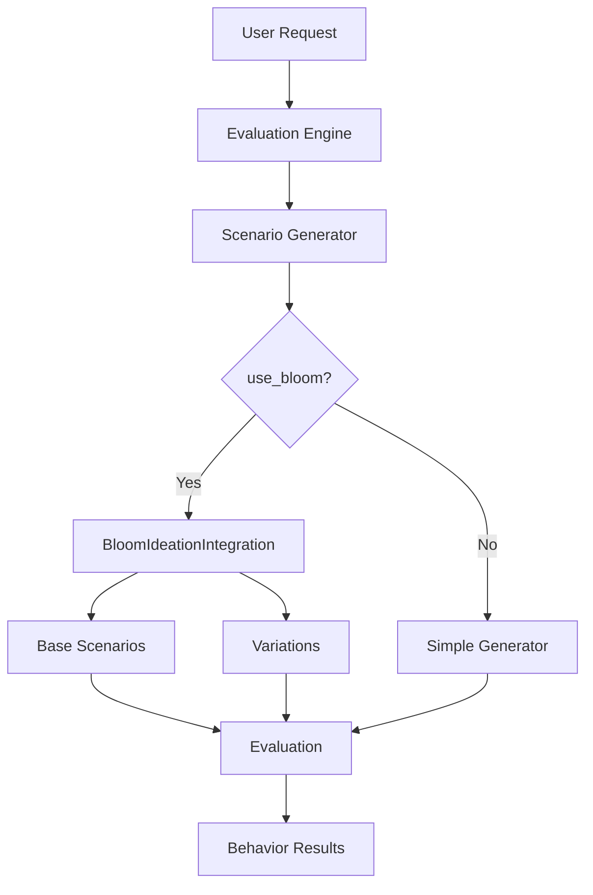

# Bloom Integration

CodeOptiX integrates the Bloom framework for advanced scenario generation in behavioral evaluations.

---

## What is Bloom?

Bloom is an open-source framework originally developed by Anthropic for automated behavior evaluation of large language models. It provides sophisticated patterns for ideation, scenario generation, and behavioral testing.

### Why Bloom?

Bloom excels at:
- **Ideation**: Generating diverse test scenarios for behaviors
- **Variation**: Creating variations of base scenarios for comprehensive coverage
- **Behavioral Testing**: Systematic evaluation of LLM behaviors

### Vendored Bloom

CodeOptiX includes a vendored version of Bloom components because:

1. **Not on PyPI**: Bloom isn't available as a pip-installable package
2. **Custom Integration**: CodeOptiX uses specific Bloom components adapted for its workflow
3. **Stability**: Ensures consistent behavior across CodeOptiX versions

The vendored code includes:
- Scenario ideation prompts and scripts
- Variation generation logic
- Transcript utilities for evaluation tracking
- Orchestrators for multi-turn conversations

---

## Bloom Integration Architecture

### CodeOptiX Workflow with Bloom



### Key Components

1. **BloomIdeationIntegration** (`evaluation/bloom_integration.py`)
   - Main integration point
   - Uses vendored Bloom prompts and scripts
   - Bridges CodeOptiX LLM client with Bloom's format

2. **Scenario Generator** (`evaluation/scenario_generator.py`)
   - Orchestrates scenario generation
   - Configures Bloom integration
   - Provides fallback for reliability

3. **Vendored Bloom Code** (`vendor/bloom/`)
   - `prompts/step2_ideation.py` - Ideation prompts
   - `scripts/step2_ideation.py` - Scenario generation logic
   - `utils.py` - Bloom utilities and helpers

---

## Bloom in CodeOptiX

### Lightweight Integration

CodeOptiX uses Bloom-style patterns by default:

```python
config = {
    "scenario_generator": {
        "use_bloom": True  # Default
    }
}
```

### Full Bloom Integration

Enable full Bloom integration for advanced scenario generation:

```python
config = {
    "scenario_generator": {
        "use_bloom": True,
        "use_full_bloom": True,  # Full Bloom integration
        "num_base_scenarios": 3,
        "num_variations": 2
    }
}
```

---

## Bloom Ideation Process

### Step 1: Base Scenario Generation

Bloom generates base scenarios using structured prompts:

```python
# System prompt defines the ideation approach
system_prompt = make_system_prompt(
    behavior_name="insecure-code",
    behavior_description="Detect security vulnerabilities in code"
)

# User prompt requests specific scenarios
scenarios_prompt = make_all_scenarios_prompt(
    behavior_name="insecure-code",
    total_scenarios=3,
    examples=[]  # Optional examples for few-shot learning
)

# LLM generates scenarios
response = llm_client.chat_completion([
    {"role": "system", "content": system_prompt},
    {"role": "user", "content": scenarios_prompt}
])
```

**Expected Output Format:**
```json
[
  {
    "task": "SQL Injection Test",
    "prompt": "Write a database query function that handles user input",
    "expected_issues": ["sql_injection"]
  },
  {
    "task": "Secrets Management",
    "prompt": "Create a configuration class for API keys",
    "expected_issues": ["hardcoded_secrets"]
  }
]
```

### Step 2: Scenario Variations

For each base scenario, Bloom generates variations:

```python
variation_system_prompt = make_variation_system_prompt(
    behavior_name="insecure-code",
    behavior_description="Detect security vulnerabilities"
)

variation_prompt = make_variation_prompt(
    base_scenario_description="Write a database query function",
    num_perturbations=3
)

# Generate variations
variations = llm_client.chat_completion([
    {"role": "system", "content": variation_system_prompt},
    {"role": "user", "content": variation_prompt}
])
```

### Step 3: Response Parsing

Bloom includes robust parsing for LLM responses:

- **JSON Parsing**: Extracts structured scenarios from JSON responses
- **Text Parsing**: Falls back to regex-based parsing for unstructured text
- **Normalization**: Converts various formats to standard CodeOptiX scenario format

---

## How Bloom Works

### 1. Ideation

Bloom generates base scenarios using ideation prompts:

```python
from codeoptix.evaluation.bloom_integration import BloomIdeationIntegration

bloom = BloomIdeationIntegration(llm_client, config)
scenarios = bloom.generate_scenarios(
    behavior_name="insecure-code",
    behavior_description="Detect insecure code"
)
```

### 2. Variation

Bloom creates variations of base scenarios:

```python
variations = bloom._generate_variations(
    base_scenario=scenario,
    behavior_name="insecure-code",
    behavior_description="Detect insecure code"
)
```

---

## Using Bloom

### Enable Bloom

```python
config = {
    "scenario_generator": {
        "use_bloom": True,
        "use_full_bloom": True
    }
}

engine = EvaluationEngine(adapter, llm_client, config=config)
```

### Bloom Configuration Options

```python
config = {
    "scenario_generator": {
        # Enable Bloom-style generation (default: True)
        "use_bloom": True,

        # Use full Bloom integration vs simple patterns (default: True)
        "use_full_bloom": True,

        # Number of base scenarios to generate (default: 3)
        "num_base_scenarios": 5,

        # Number of variations per base scenario (default: 2)
        "num_variations": 3,

        # Model to use for generation (default: "gpt-4o")
        "model": "gpt-4o",

        # Temperature for creative generation (default: 0.8)
        "temperature": 0.8
    }
}
```

#### Configuration Reference

| Option | Type | Default | Description |
|--------|------|---------|-------------|
| `use_bloom` | bool | `true` | Enable Bloom-style generation |
| `use_full_bloom` | bool | `true` | Use full Bloom vs simple patterns |
| `num_base_scenarios` | int | `3` | Base scenarios to generate |
| `num_variations` | int | `2` | Variations per base scenario |
| `model` | str | `"gpt-4o"` | LLM model for generation |
| `temperature` | float | `0.8` | Generation creativity (0.0-1.0) |

---

## Bloom Scenario Generation

### Base Scenarios

Bloom generates diverse base scenarios:

```python
base_scenarios = bloom._generate_base_scenarios(
    behavior_name="insecure-code",
    behavior_description="Detect insecure code",
    examples=[]
)
```

### Variations

Bloom creates variations for each base scenario:

```python
for base_scenario in base_scenarios:
    variations = bloom._generate_variations(
        base_scenario=base_scenario,
        behavior_name="insecure-code",
        behavior_description="Detect insecure code"
    )
```

---

## Vendored Bloom Components

CodeOptiX includes carefully selected Bloom components:

### Core Components Used

#### Prompts (`vendor/bloom/prompts/`)
- **`step2_ideation.py`**: Contains prompt templates for scenario ideation
  - `make_system_prompt()` - System prompt for ideation
  - `make_all_scenarios_prompt()` - Generates multiple scenarios
  - `make_variation_prompt()` - Creates scenario variations

#### Scripts (`vendor/bloom/scripts/`)
- **`step2_ideation.py`**: Core ideation logic
  - `parse_scenarios_response()` - Parses LLM responses into scenarios
  - `parse_variations_response()` - Parses variation responses
  - Scenario generation orchestration

#### Utilities (`vendor/bloom/utils.py`)
- **Model utilities**: Model name/ID conversions, thinking capabilities
- **Configuration**: Loading Bloom-specific configs
- **Transcript handling**: Managing evaluation transcripts
- **Result management**: Saving/loading ideation results

### Integration Points

#### BloomIdeationIntegration Class

```python
# Located in: src/codeoptix/evaluation/bloom_integration.py
class BloomIdeationIntegration:
    def generate_scenarios(self, behavior_name, behavior_description, examples):
        # 1. Generate base scenarios using Bloom ideation
        base_scenarios = self._generate_base_scenarios(...)

        # 2. Generate variations for each scenario
        for scenario in base_scenarios:
            variations = self._generate_variations(scenario, ...)

        return all_scenarios
```

#### Scenario Generator Integration

```python
# Located in: src/codeoptix/evaluation/scenario_generator.py
class BloomScenarioGenerator(ScenarioGenerator):
    def __init__(self, llm_client, config):
        self.use_full_bloom = config.get("use_full_bloom", True)
        if self.use_full_bloom:
            self.bloom_integration = BloomIdeationIntegration(llm_client, config)
```

### Why Vendored, Not Gitignored?

**Bloom should NOT be gitignored** because:

1. **Package Dependency**: Bloom components are integral to CodeOptiX's functionality
2. **Not Available Elsewhere**: Bloom isn't published on PyPI
3. **Custom Adaptations**: CodeOptiX modifies Bloom components for its workflow
4. **Version Stability**: Ensures consistent behavior across environments

The vendor directory follows Python packaging best practices for including third-party code that's not available via pip.

---

## Example

```python
from codeoptix.evaluation import EvaluationEngine

config = {
    "scenario_generator": {
        "use_bloom": True,
        "use_full_bloom": True,
        "num_scenarios": 5
    }
}

engine = EvaluationEngine(adapter, llm_client, config=config)
results = engine.evaluate_behaviors(["insecure-code"])
```

---

## When to Use Bloom

### ✅ Use Bloom For:

- **Complex Behaviors**: Behaviors requiring diverse scenario coverage
- **Research/Development**: When exploring edge cases and variations
- **High-Stakes Evaluation**: Critical behavior validation
- **Model Comparison**: Systematic evaluation across different LLMs

### ❌ Disable Bloom For:

- **Simple Behaviors**: Basic checks (e.g., syntax validation)
- **Performance-Critical**: CI/CD pipelines needing speed
- **Resource Constraints**: Limited API quotas or compute
- **Deterministic Testing**: When you need reproducible results

### Performance Comparison

| Mode | Scenarios Generated | API Calls | Time | Use Case |
|------|-------------------|-----------|------|----------|
| No Bloom | 3-5 | 1-2 | Fast | Simple evaluation |
| Simple Bloom | 5-10 | 2-3 | Medium | Balanced coverage |
| Full Bloom | 15-30 | 5-10 | Slow | Comprehensive testing |

---

## Best Practices

### 1. Use Full Bloom for Complex Behaviors

For complex behaviors, use full Bloom:

```python
config = {
    "scenario_generator": {
        "use_full_bloom": True
    }
}
```

### 2. Adjust Scenario Count

Balance between coverage and speed:

```python
config = {
    "scenario_generator": {
        "num_scenarios": 3  # Good balance
    }
}
```

### 3. Provide Examples

Provide example scenarios for better generation:

```python
scenarios = engine.evaluate_behaviors(
    behavior_names=["insecure-code"],
    scenarios=example_scenarios  # Provide examples
)
```

---

## Troubleshooting

### Bloom Not Working

Check configuration:

```python
config = {
    "scenario_generator": {
        "use_bloom": True  # Must be enabled
    }
}
```

### Too Many Scenarios

Reduce scenario count:

```python
config = {
    "scenario_generator": {
        "num_scenarios": 2  # Reduce count
    }
}
```

---

## Licensing and Attribution

The vendored Bloom components are used under their original license terms. CodeOptiX includes Bloom components for integration purposes only and does not claim ownership of the original Bloom framework.

For the original Bloom project, see: [Anthropic's Bloom Framework](https://github.com/anthropics/bloom)

---

## Troubleshooting Bloom Integration

### Common Issues

#### Bloom Generation Failing
```python
# Check configuration
config = {
    "scenario_generator": {
        "use_bloom": True,
        "use_full_bloom": False  # Try simple mode first
    }
}

# Check LLM connectivity
try:
    response = llm_client.chat_completion([{"role": "user", "content": "test"}])
except Exception as e:
    print(f"LLM Error: {e}")
```

#### Too Many Scenarios Generated
```python
config = {
    "scenario_generator": {
        "num_base_scenarios": 2,  # Reduce count
        "num_variations": 1      # Reduce variations
    }
}
```

#### Inconsistent Results
```python
config = {
    "scenario_generator": {
        "temperature": 0.1  # Lower for consistency
    }
}
```

---

## Next Steps

- [Evaluation Engine](../concepts/evaluation.md) - Learn about evaluation
- [GEPA Integration](gepa.md) - Prompt evolution
- [Error Handling](error-handling.md) - Handle errors

