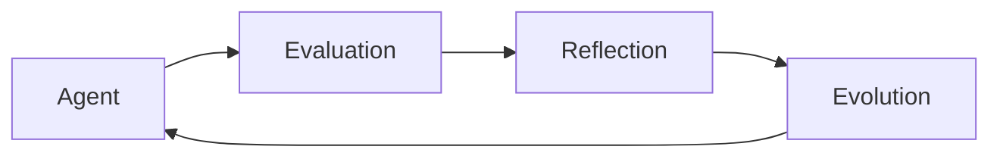

# Core Concepts Overview

Understanding the fundamental concepts behind CodeOptiX.

> **Agentic Code Optimization. Elevated Agent Experience.**

---

## What is CodeOptiX?

CodeOptiX is an **agentic code optimization platform** for AI coding agents. It helps you:

- ✅ **Evaluate** agent behavior
- ✅ **Reflect** on results
- ✅ **Evolve** agent prompts

---

## The Workflow

CodeOptiX follows a simple workflow:



### 1. Evaluation

Test your agent against behavior specifications:

```python
results = engine.evaluate_behaviors(
    behavior_names=["insecure-code", "vacuous-tests"]
)
```

### 2. Reflection

Understand why the agent behaved the way it did:

```python
reflection = reflection_engine.reflect(results)
```

### 3. Evolution

Automatically improve agent prompts:

```python
evolved = evolution_engine.evolve(results, reflection)
```

---

## Key Components

### Agent Adapters

**What**: Connect CodeOptiX to your coding agent

**Why**: CodeOptiX works with any agent through adapters

**Example**:
```python
adapter = create_adapter("codex", config)
```

### Behavior Specifications

**What**: Define what behaviors to evaluate

**Why**: Modular, reusable behavior definitions

**Example**:
```python
behavior = create_behavior("insecure-code")
result = behavior.evaluate(agent_output)
```

### Evaluation Engine

**What**: Orchestrates the evaluation process

**Why**: Handles scenario generation, execution, and scoring

**Example**:
```python
engine = EvaluationEngine(adapter, llm_client)
results = engine.evaluate_behaviors(["insecure-code"])
```

### Reflection Engine

**What**: Analyzes evaluation results

**Why**: Provides insights and recommendations

**Example**:
```python
reflection = reflection_engine.reflect(results)
```

### Evolution Engine

**What**: Optimizes agent prompts

**Why**: Automatically improves agent behavior

**Example**:
```python
evolved = evolution_engine.evolve(results, reflection)
```

### ACP Integration

**What**: Agent Client Protocol integration for editor support

**Why**: Connect CodeOptiX to editors and orchestrate multiple agents

**Example**:
```python
from codeoptix.acp import ACPQualityBridge

bridge = ACPQualityBridge(agent_command=["python", "agent.py"], auto_eval=True)
await bridge.connect()
```

---

## How It Works

### Step 1: Scenario Generation

CodeOptiX generates test scenarios:

```python
scenarios = generator.generate_scenarios(
    behavior_name="insecure-code",
    behavior_description="Detect insecure code"
)
```

### Step 2: Agent Execution

Your agent runs on each scenario:

```python
agent_output = adapter.execute(scenario["prompt"])
```

### Step 3: Evaluation

CodeOptiX evaluates the output:

```python
result = behavior.evaluate(agent_output)
```

### Step 4: Aggregation

Results are aggregated:

```python
overall_score = sum(scores) / len(scores)
```

---

## Architecture

```
┌─────────────────────────────────────────┐
│           CodeOptiX Core                 │
├─────────────────────────────────────────┤
│  ┌──────────┐  ┌──────────┐  ┌────────┐│
│  │  Agent   │  │ Behavior │  │ Eval   ││
│  │ Adapters │  │   Specs  │  │ Engine ││
│  └──────────┘  └──────────┘  └────────┘│
│  ┌──────────┐  ┌──────────┐  ┌────────┐│
│  │Reflection│  │Evolution │  │Artifact││
│  │ Engine   │  │  Engine  │  │Manager ││
│  └──────────┘  └──────────┘  └────────┘│
└─────────────────────────────────────────┘
```

---

## Next Steps

Learn more about each component:

- [Agent Adapters](adapters.md) - Connecting to agents
- [Behavior Specifications](behaviors.md) - Defining behaviors
- [Evaluation Engine](evaluation.md) - Running evaluations
- [Reflection Engine](reflection.md) - Understanding results
- [Evolution Engine](evolution.md) - Improving agents

